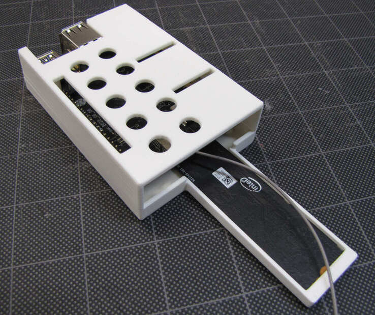

# quartz64-case
This repo holds the FreeCAD files for a 3D-printable case for the
Quartz64 Model B. It's shaped and designed for the V1.4 revision,
which is what I have. It might fit others but it won't be fully
compatible with the V1.0 revision pictured on the Pine64 wiki.

Get the STLs from the Releases page. `quartz64_sd_base.stl` is for
using the Quartz with a microSD card, `quartz64_nvme_base.stl` is for
using the Quartz with a 80mm NVMe drive, and `quartz64_case_lid.stl`
is the lid for both bases.

I printed this on my Prusa i3 MK3S+ at different layer heights, with
best results at 0.15mm and 0.20mm.

